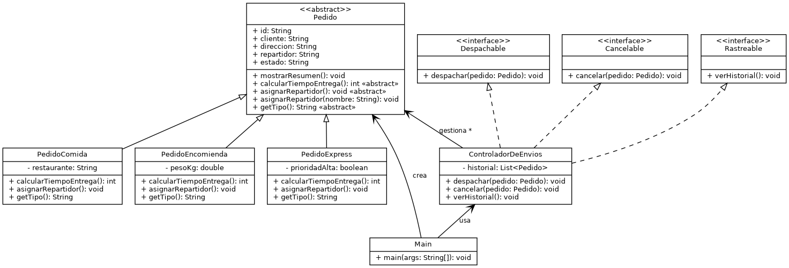

# SpeedFast — Sistema de Reparto (Semana 3)

Diseño e implementación del sistema de reparto **SpeedFast**, integrando
**polimorfismo, abstracción e interfaces**, según la pauta de la actividad
"Diseñando un sistema orientado a objetos con clases abstractas,
polimorfismo e interfaces".

## Contenido del repositorio

```
speedfast-semana3/
├── src/com/speedfast/
│   ├── Pedido.java                (clase abstracta)
│   ├── PedidoComida.java          (subclase)
│   ├── PedidoEncomienda.java      (subclase)
│   ├── PedidoExpress.java         (subclase)
│   ├── Despachable.java           (interfaz)
│   ├── Cancelable.java            (interfaz)
│   ├── Rastreable.java            (interfaz)
│   ├── ControladorDeEnvios.java   (implementa las 3 interfaces)
│   └── Main.java                  (simulación / punto de entrada)
├── docs/
│   └── diagrama_clases.png        (diagrama de clases UML)
└── README.md
```

## Cómo ejecutar

**Desde IntelliJ IDEA:**
1. Abrir la carpeta `speedfast-semana3` como proyecto.
2. Marcar `src` como *Sources Root* si no se detecta automáticamente.
3. Ejecutar la clase `com.speedfast.Main`.

**Desde línea de comandos** (requiere JDK 17+):
```bash
cd speedfast-semana3
javac -d out $(find src -name "*.java")
java -cp out com.speedfast.Main
```

## Diagrama de clases



## Decisiones de diseño

**Abstracción.** `Pedido` es una clase abstracta que concentra los
atributos comunes (`id`, `cliente`, `direccion`, `repartidor`, `estado`)
y el método `mostrarResumen()`, ya implementado porque su estructura es
igual para cualquier tipo de pedido. En cambio, `calcularTiempoEntrega()`
es abstracto porque cada tipo de pedido calcula el tiempo de forma
distinta.

**Polimorfismo.** Las subclases `PedidoComida`, `PedidoEncomienda` y
`PedidoExpress` **sobrescriben** `asignarRepartidor()` con su propia
regla de negocio (repartidor en moto, en furgón/camioneta, o de
disponibilidad inmediata, respectivamente). Además, `Pedido` define una
versión **sobrecargada** `asignarRepartidor(String nombre)` para la
asignación manual, compartida por herencia entre todas las subclases.

**Interfaces.** `Despachable`, `Cancelable` y `Rastreable` se
implementaron en una clase adicional, `ControladorDeEnvios`, en lugar
de en las clases de pedido. Esto separa "qué es un pedido" (Pedido y
sus subclases) de "qué se hace con un pedido" (despachar, cancelar,
consultar historial), reduciendo el acoplamiento: si el proceso de
despacho cambia, solo se modifica `ControladorDeEnvios`.

**Escalabilidad, reutilización y mantenibilidad.**
- *Escalabilidad*: agregar un nuevo tipo de pedido (p. ej.
  `PedidoProgramado`) solo requiere crear una subclase de `Pedido` e
  implementar sus dos métodos abstractos; el resto del sistema
  (`ControladorDeEnvios`, `Main`) no necesita cambios.
- *Reutilización*: atributos, `mostrarResumen()` y la asignación
  manual viven una sola vez en `Pedido` y se heredan en todas las
  subclases.
- *Mantenibilidad*: cada responsabilidad vive en su propia clase o
  interfaz (principio de responsabilidad única), lo que facilita
  ubicar y modificar código sin efectos colaterales en otras partes
  del sistema.

## Simulación (clase `Main`)

`Main` demuestra, en orden:
1. Creación de 4 pedidos (2 Comida, 1 Encomienda, 1 Express).
2. Asignación automática de repartidor para cada uno (polimorfismo).
3. Asignación manual de repartidor para un pedido (sobrecarga).
4. Cálculo y visualización del tiempo estimado de entrega de cada uno.
5. Despacho de 3 pedidos.
6. Cancelación de 1 pedido.
7. Visualización del historial completo de pedidos procesados
   (almacenado en un `ArrayList<Pedido>` dentro de `ControladorDeEnvios`).

## Pendiente antes de la entrega

- [ ] Subir este proyecto a un repositorio público de GitHub, dentro de
      una carpeta llamada `semana 3`.
- [ ] Comprimir el proyecto en `.zip` o `.rar` y subirlo también al AVA.
- [ ] Copiar el enlace del repositorio y entregarlo en el AVA (ver
      "Recordatorio: ¿Cómo crear un repositorio en GitHub?" en las
      instrucciones de la actividad).
